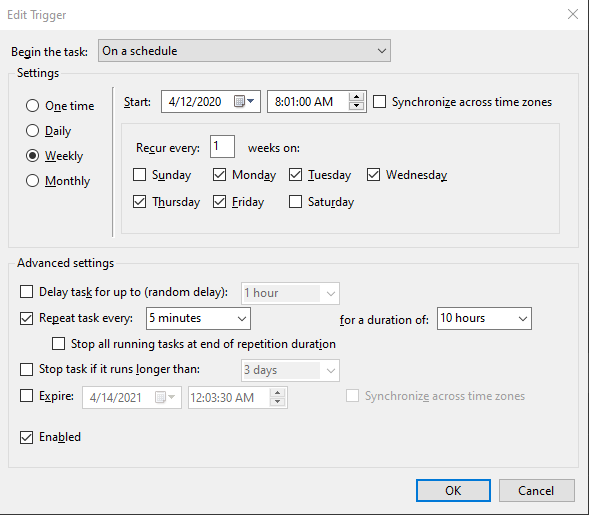
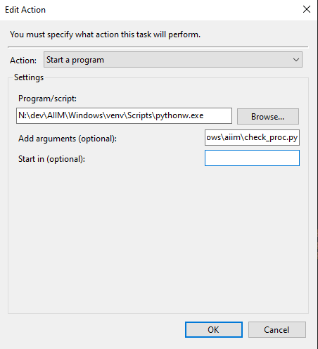

# AIIM
##### Am I In (a) Meeting?

This app will detect if you are in a meeting in Zoom or Microsoft Teams and send a REST call to a Raspberry Pi which will them either turn on or off an LED. This was written
to work with Windows for now but I will try to add Mac and Linux support. I welcome pull requests! This does **NOT** utilize any kind of APIs to determine if you are in a meeting.
No APIs means lower risk for data exposure (I understand there has been a lot of concerns around zoom privacy and security). This app only cares about the processes.

##### How does this work?

Here's a quick summary of how things work:

1. Python script is run on a schedule using Task Scheduler which checks for the Zoom or Microsoft Teams processes. 
2. If you are in a meeting, the script makes a REST call to a Raspberry Pi running a Flask app.
3. Depending on your settings, it'll either turn the GPIO on/off or do some cool things with NeoPixel LEDs. 

Zoom meeting detection works really well. However, Microsoft Teams isn't guaranteed. The way this script tells if you are in a Teams meeting is by reading the Window Title. When
you first enter a meeting, the window title is "Meeting | Microsoft Teams" - however, if you switch to chat or activity or any other tab within Teams, the window title changes 
and DOES NOT change back to "Meeting" even after you go back to your meeting. It's very strange.  

## Demo

TBD

## Table of Contents

1. [Getting Started](#getting-started)
2. [Windows Setup](#windows)
    1. The Code
        1. [Configuration](#aiimconfigpy)
        2. [Check Process Script](#aiimcheck_procpy)
    2. [Scheduled Task](#scheduled-task)
    3. [Detecting Meetings](#detecting-meetings)
        1. [Zoom](#zoom)
        2. [Microsoft Teams](#microsoft-teams)
2. [Raspberry Pi Setup](#raspberry-pi-setup)
    1. [Installation](#installation)
    2. [Configuration](#configuration)
    3. [Simple vs. NeoPixel](#simple-vs-neopixel)
    4. [Endpoint](#endpoint)
3. [Future](#future-todo)
4. [Authors](#authors)
5. [License](#license)
6. [Questions](#questions-)
7. [Contribute](#contribute)

## Getting Started

There are two directories in this repo: Windows and Raspberry Pi;

The Windows directory contains the script that will be run on a scheduled task on your Windows machine. And the Raspberry Pi contains the Flask app that needs to run on your Pi.
More info on the Flask app can be found in the [Raspberry Pi Setup](#raspberry-pi-setup) section below. 


## Windows

You need Python 3+ installed locally. I recommend at least version 3.6. Check out the official documentation on how to install Python on Windows here: https://docs.python.org/3/using/windows.html

I also recommend making sure Python is available as a path variable so that you can run it on a basic command prompt without issues. 

#### `aiim/config.py`

The config needs some of your attention. Edit the `config.py` file:

```python
PI_URL = 'http://{{your_rpi_addr}}'
URL_CONTEXT = 'led'
LED_TYPE = '{{simple/neopixel}}'
ZOOM = True
TEAMS = True
```

Change the `PI_URL` to your Pi's IP address or hostname. 

The `URL_CONTEXT` by default is `led`. If you change the context in the Raspberry Pi Apache Configs, change this value. 

The `LED_TYPE` will take one of two values: `simple` or `neopixel`.  The `simple` led type is if you're controlling a basic LED. This can actually be used with relays and transistors as
well. Endless possibilities since all this does is turn a GPIO pin on and off. The `neopixel` led type requires you to use WS2812x LEDs. This is similar to my 
[Dancy Pi](https://github.com/naztronaut/dancyPi-audio-reactive-led) set up. `neopixel` is currently the default.

By default, both `ZOOM` and `TEAMS` are set to true because the script will look for both. If you only want to look for
one or the other, change the value to `False`. Changing both to `False` will mean that they are both `True`. 

#### `aiim/check_proc.py`

I recommend running things in a virtual environment, but it is not necessary. The only requirement this project has for Windows is `requests` and I think it's fine to install that globally.

But if you want to install a `venv`, you can do so by going into the `Windows\` directory and running:

```shell
python -m venv venv
```

This will download an install a virtual environment called `venv`. Your directory should now have a `venv\` directory along with your `aiim\` package. This app is not complex
so it doesn't really matter where your `venv` gets installed. 

Activate `venv` with this command:
 
```shell
venv\Scripts\activate.bat
```

This should add the `(venv)` prefix to your command prompt line, indicating that you are in your virtual environment. You need to then install the `requests` module so that you can 
make a REST call:

```shell
pip install requests
```


If you already have your Pi running, you can test the script with:

```shell
python check_proc.py
```

It'll either error out or give you nothing. 

The main part about this script is the command to generate the task list:

```python
os.popen('tasklist /fo table /v /fi "imagename eq CptHost.exe" && tasklist /fo table /v /fi "imagename eq Teams.exe" /fi "windowtitle eq Meet*" /nh')
``` 

This invokes the `tasklist` command twice. The first time it looks for `CptHost.exe` which is the process for a Zoom meeting. Zoom is simple so as long as that's running, 
you're in a Zoom meeting. 

The second is it looks for `Teams.exe` which is the Microsoft Teams process. But we need to filter it further to look for a window title to equal to `Meet*` because we are searching for
a window titled "Meeting | Microsoft Teams".  

As mentioned above, Microsoft Teams is a little weird. If you start/join a meeting, your window title will be "Meeting | Microsoft Teams" - however, if you switch to enter
component within teams (e.g. activity, chat, etc.), the title will change and the app will think you are no longer in a meeting (once the scheduled task runs). Even if you go 
back to your meeting in Teams, the window will NOT change back to "Meetings | Microsoft Teams" - why? I don't know. 

The app is more accurate for Zoom meetings than it is with Microsoft Teams.

The `/v` flag is for verbose so the call can take a long time. However, adding the `/fi` flag for filtering makes it significantly faster! 

### Scheduled Task

We are trilling the `check_proc.py` script using a Scheduled Task in Windows. You can set this to any schedule you'd like, but I recommend running it during work hours (plus/minus
an hour or two depending on how long you actually work) starting at minute 01 (meaning start it at 8:01 AM instead of 8:00 AM) because it could take you a minute to join a meeting. 
And then run this every 5 minutes (so it'll run at 8:01, 8:06, 8:11, etc.). At best, the script will know you're in a meeting within a few seconds and at worse, you'll have to wait 5
minutes. 

Here's an example of the Scheduled Task trigger:



The task runs from 8:01 AM to 6 PM (10 hours duration) every 5 minutes Monday thur Friday. 

Here's an example of the the action:



The "Program/Script" should use your `pythonw.exe` - if you are using a virtual environment like I am, put that path in. If you are using your global, find where your global `pythonw.exe` 
is located and put the path in there. 

**NOTE**: We are using `pythonW` and not just `python` - this is necessary in order to run this script in the background. If you don't use the `W`, it'll open a command prompt every time
it runs and you'll see it in your taskbar.

One downside of using `pythonw` is that if the app fails, it'll fail silently and will not warn you. `pythonw` simply starts the script then exists. I do want to set up some kind of
logging in the future to output errors so that you are aware. 

The "add arguments" should be the path to your `check_proc.py` - where ever it's stored. It should be the full path because your Task Scheduler won't know where to look and the script
won't run.  

I am running it every 5 minutes, feel free to run it every 1 minute if you desire. Windows Task Scheduler doesn't let you set an interval of less than one minute. 

### Detecting Meetings

Some of this is repeat from above but more organized in its own sections. The script uses your `tasklist` to see what processes are running. The main command is:

```python
os.popen('tasklist /fo table /v /fi "imagename eq CptHost.exe" && tasklist /fo table /v /fi "imagename eq Teams.exe" /fi "windowtitle eq Meet*" /nh')
``` 

##### Zoom

The Zoom meeting process is `CptHost.exe` - it is the image name and is pretty simple. If it's detected, your are in a meeting!

##### Microsoft Teams 

Microsoft Teams meeting is run within the `Teams.exe` process, so we filter our tasklist for this process first. Then we filter it further and look at the Window Title of `Meet*`
because we are searching for a window titled "Meeting | Microsoft Teams".  

If you start/join a meeting, your window title will be "Meeting | Microsoft Teams" - however, if you switch to enter
component within teams (e.g. activity, chat, etc.), the title will change and the app will think you are no longer in a meeting (once the scheduled task runs). Even if you go 
back to your meeting in Teams, the window will NOT change back to "Meetings | Microsoft Teams".

## Raspberry Pi Setup

The Raspberry Pi set up is more simple in the sense that I've covered these topics many times in previous tutorials. The main thing to know is that the Pi app
is a Flask app running behind Apache so that you can make simple REST calls to turn your LED on and off. 

Another way of handling this would be MQTT which I MAY add to this script in the future. 

In the meantime, the topics you will need to know are:

1. [Headless Raspberry Pi](https://www.easyprogramming.net/raspberrypi/headless_raspbery_pi.php)
2. [Control an LED From Your Browser](https://www.easyprogramming.net/raspberrypi/browser_control_led.php)

Please note that the second tutorial above is a culmination of these three tutorials which goes deeper into their specific topics:
1. [Run Apache on your Pi](https://www.easyprogramming.net/raspberrypi/pi_apache_web_server.php)
2. [Running a Flask App on your Pi](https://www.easyprogramming.net/raspberrypi/pi_flask_app_server.php)
3. [Run Flask behind Apache](https://www.easyprogramming.net/raspberrypi/pi_flask_apache.php)

#### Installation

To install this on your Pi, you can clone this repo to your local Windows machine and copy over all the files in the `Windows\` directory to your Pi. But the Raspberry Pi piece is 
pretty simple so cloning the whole repository again may not be necessary. So I'm including a .zip you can `WGET` in the `RaspberryPi/pi_dist` directory. In your Pi, do this:

```shell
cd /var/www/html
wget https://github.com/naztronaut/AIIM/blob/master/RaspberryPi/pi_dist/led.zip
unzip led.zip
```

This should unzip and put everything in a `/led` directory. 

#### Configuration

There are a couple of configuration considerations to take. The first is the GPIO pin used as the data pin. By default, the pin used for both `simple` and `neopixel` set up
is GPIO Pin 18. If you want to change this for the "Simple" set up, the following value for `PIN` should be changed in `led.py`:

```python
PIN = 18
```

If you want to change this for the "NeoPixel" set up, change the `D18` to `D#` in `neopix.py`:

```python
pixels = neopixel.NeoPixel(board.D18, LED_COUNT)
```

The second config change to consider if you're using the 'NeoPixel' set up is the LED Count in `neopix.py`. You need to tell the app how many LEDs your set up has by 
changing the value of `LED_COUNT` shown below: 

```python
LED_COUNT = 142
```

The default is 142 LEDs since that's what I have. This should work with any number of LEDs, whether you have 1 or 300. The only limitation that you may run into is current. 


#### Simple vs. NeoPixel

The only addition is that since this script allows a "Simple" or "NeoPixel" LED output. By default, the script uses "Simple" which means it only turns the GPIO pin on or off. It's simple
but you can do a lot with it. You can turn an LED on and off, you can control a relay which controls an actual appliance, a transistor which can turn on and off really fast. 
If you are using the Simple mode then you don't have to touch the script. 

However, if you want to use the 'NeoPixel' mode. You have to take a few actions. First, we need to install the `adafruit-circuitpython-neopixel` library. To do this, if you are 
using a virtual environment, activate `venv`, then run the command below. If you are  not using a `venv` or want to install this globally, prepend the command below with `sudo` 
as you'll need higher privileges to run the script. 
 
```shell
pip3 install adafruit-circuitpython-neopixel
```
 
Get more info on this library at https://pypi.org/project/adafruit-circuitpython-neopixel/

Make sure your power supply can supply enough current (I recommend at least a 2A power supply if you have more than 100 LEDs). 

#### Endpoint
We'll use a simple REST call to trigger that will turn on or off an LED based on a scheduled task:

```bash
http://{ip_addr}/led?type=simple/neopixel&status=on/off
```

You either send a `simple` or `neopixel` as the type and `on` or `off` as the status. If everything is set up as expected, the status of `on` or `off` will turn the light on 
and off. If you decide to change the context path in the `check_proc.py` file from `/led` to something else.

## Future TODO 

I do want to do a little bit more with this script. Currently, it's a 1:1 set up. It can be easily modified to allow multiple inputs to turn on multiple LEDs and I will work on making
that a little easier to set up.

MQTT may be a great way to communicate with the PI. I want to set up a version that publishes a message to an MQTT broker instead of making a REST call. 

Other TODO TBD.

## Authors
* **Nazmus Nasir** - [Nazmus](https://nazm.us) - Owner of EasyProgramming.net

## License

This project is licensed under the MIT License - see the [LICENSE](LICENSE) file for details

## Questions ?
Have questions? You can reach me through several different channels. You can ask a question in the  [issues forum](/../../issues), 
on [EasyProgramming.net](https://www.easyprogramming.net), or on the video comments on YouTube. 


## Contribute 
I will accept Pull requests fixing bugs or adding new features after I've vetted them. Feel free to create pull requests!  